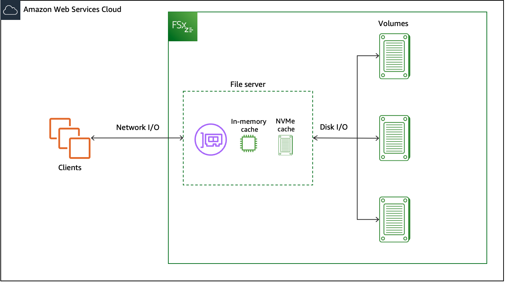
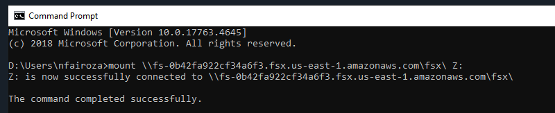
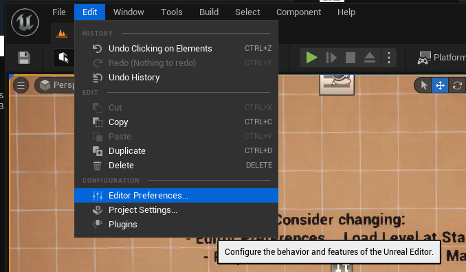
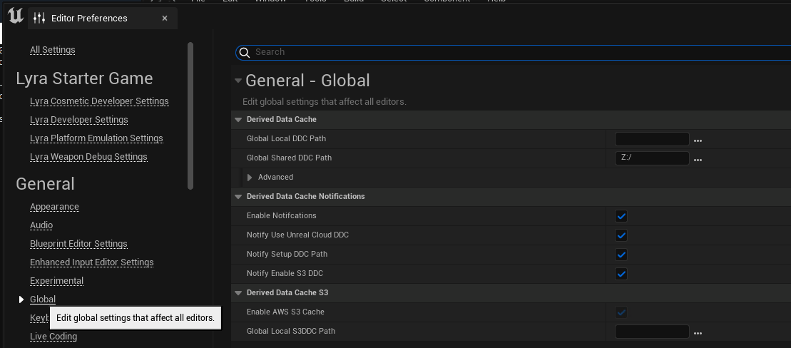

## Boosting Unreal Engine Performance with AWS FSxZ as a Shared Derived Data Cache

The Derived Data Cache (DDC) in Unreal Engine serves as a storage mechanism for data that is computationally expensive to generate.DDC stores processed derived asset data such as shader compilations, texture compressions, and geometry conversions in a way that can be quickly accessed by the engine during load times. This is especially important for larger teams and projects, as it reduces the need to recompile assets constantly, thus saving a lot of time and computational resource. DDC can be local to a single user or shared across a team via a network to improve the efficiency of the development pipeline. Setting up a cloud-based shared Derived Data Cache (DDC) can offer scalability and high availability for your Unreal Engine projects. By leveraging AWS storage services, you can easily share and access cached data from anywhere. In this post, we are going to focus on shred DDC with AWS Fsx for Open ZFS.

AWS Fsx for OpenZFS is a fully managed shared storage built on the popular OpenZFS file system. It is a simple and powerful shared NFS file storage that delivers leading price/performance on AWS. Each FsxZ has a file server, which is equipped with a high-speed, in-memory cache. Beyond the in-memory cache, Single-AZ2 filesystems offer an additional NVMe cache which can be used to store a large derived assets and have fast response times. It leverages both the ARC and L2ARC in the OpenZFS filesystem, which enhances data access from in-memory and NVMe caches, ensuring faster data access and improved performance. Although FsxZ is capable of Multi-AZ deployments, we could use Single-AZ2 for optimized cost of Unreal Engine DDC. As as the Derived data is not critical data and is easily reproducible. Usually, with DDC pulls there are times of high request rates with times of long idle durations. Amazon FSxZ has the capability to burst beyond baseline speeds, accommodating both network I/O and disk I/O operations with the help of I/O credit mechanism

## Using the Terraform Template

**Clone the Repository:** Start by cloning the repository to your local machine or cloud development environment.

**Configure the Template:** Open the repo files and fill in your specific AWS and Unreal Engine configuration details in *inputs.tfvars* file.

**Execute the Terraform Plan:** Run the Terraform commands to initialize and apply the plan. This will set up your FSxZ file system and network configurations as defined in the template.

**Integrate with Unreal Engine:** Once the infrastructure is deployed, Now you can mount the FSxZ to your workstations and configure the Unreal Engine Editor to use this new setup as the DDC.
Follow the instruction [in this documentation](https://docs.aws.amazon.com/fsx/latest/OpenZFSGuide/mount-openzfs-volumes.html) to mount the newly created fsxZ to your workstation.

To configure the Unreal Engine Editor to recognize FSxZ as the DDC. Navigate to Edit and then to Editor Preferences in your Unreal Engine Editor.

In the Unreal Engine Editor Preferences, look for Global Shared DDC Path Parameter. Here, you will input the FSxZ mount path that you have configured. Essentially, you are directing the Unreal Engine to use the assigned FSxZ mount path as the location for the Global Shared Derived Data Cache. 

## You are now setup to use FSX for OpenZFS as Shared DDC.

## Security

See [CONTRIBUTING](CONTRIBUTING.md#security-issue-notifications) for more information.

## License

This library is licensed under the MIT-0 License. See the LICENSE file.

